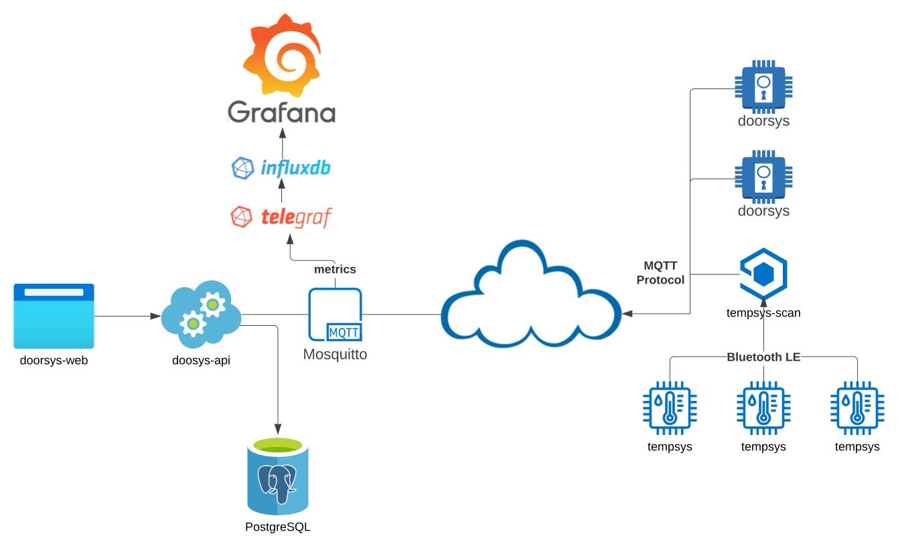
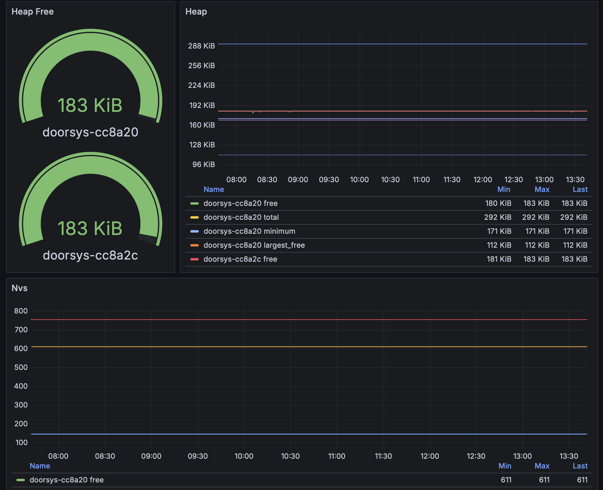
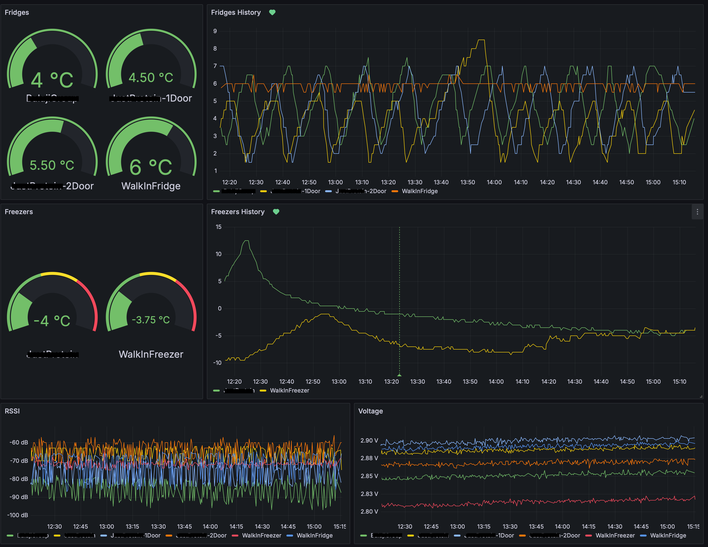

<!-- vim: set tw=80: -->

# Autosys

Various automation related IoT projects using rust that communicate primarily
using MQTT.

## Architecture

## Doorsys

Doorsys is a door access control system with centralized management and logs.

### Introduction

Doorsys was born out of frustration with consumer-grade smart locks. I needed
something more reliable with centralized logs, multiple access codes and badges,
and more importantly, remote management. After surveying the landscape, I came
to the realization that the options weren't great. Either you settle for a
subpar solution using one of the existing smart locks + app available on the
marketplace, or you have to spend an arm and a leg and step up to a more
professional solution. I did neither. I did what every engineer would do: roll
my own solution! How difficult can it be right? Famous last words :)

Jokes aside, I took it as a challenge. After some research, I figured the
hardware necessary was readily available online and an ESP32 microcontroller
would be more than enough to run the firmware. I started the development of the
firmware using C and the official
[ESP-IDF](https://github.com/espressif/esp-idf) but later on switched to the
experimental but now highly capable rust based
[ESP-RS](https://github.com/esp-rs) implementation.

### Relevant Repositories

- [doorsys-hardware](https://github.com/fabiojmendes/doorsys-hardware): in depth
  hardware breakdown, schematics, and PCB design.
- [doorsys-firmware](https://github.com/fabiojmendes/doorsys-firmware): ESP32-C3
  compatible firmware for controlling the hardware and communication with the
  backend.
- [doorsys-protocol](https://github.com/fabiojmendes/doorsys-protocol): Defines
  the messages supported by the platform.
- [doorsys-api](https://github.com/fabiojmendes/doorsys-api): Rest API for the
  admin interface and also handler for the MQTT messages.
- [doorsys-web](https://github.com/fabiojmendes/doorsys-web): Web interface for
  the admin console.

### Observability

The firmware will constantly report heap and flash usage using MQTT messages
using the
[InfluxDB line protocol](https://docs.influxdata.com/influxdb/v1/write_protocols/line_protocol_tutorial/)
format. Telegraf is used to consume those messages and write to the InfluxDB
instance while a Grafana dashboard was set up for visualization.

### Deployment

The firmware is meant to be flashed straight to the device. Over the air updates
are not supported at the moment. The repository has more information and
instructions on how to do this. Container images are provided for the API and
web components which can then be deployed using docker or podman. Personally I
run it using podman and quadlet units (systemd) but pick you poison.

## Tempsys

Tempsys is a monitoring system designed to measure the temperature of commercial
fridges and freezers. It is meant to monitor the behavior of these units and
anticipate any possible failures or misuse and prevent food degradation.

It consists of an extremely power efficient Bluetooth LE module coupled with a
MCP9808 i2c digital thermometer. The whole system is powered by a single CR-2032
coin cell battery with autonomy of more than a year.

While the low power Bluetooth module is responsible to emit advertising packets
with the temperatures. A more powerful device connected to the main power will
collect those results and ship them via MQTT using the line protocol as
described earlier for Doorsys.

On the backend, Telegraf and InfluxDB are used to collect and store those
metrics. A Grafana [dashboard](#tempsys-dashboard) is configured with alerts in
case temperatures are sustained above certain threshold.

On top of the temperature, the module will also send its current voltage and
RSSI for observability purposes. This will help predict when it is time to
change the battery or if the device needs to be moved for better reception.

### Repositories

- [tempsys-hardware](https://github.com/fabiojmendes/tempsys-hardware) in-depth
  hardware description for the Tempsys device
- [tempsys-firmware](https://github.com/fabiojmendes/tempsys-firmware)
  embassy-rs based firmware for Tempsys
- [tempsys-scan](https://github.com/fabiojmendes/tempsys-scan) Bluez based
  application to read the Bluetooth advertising events from Tempsys and ship
  them via MQTT

### Tempsys Dashboard

