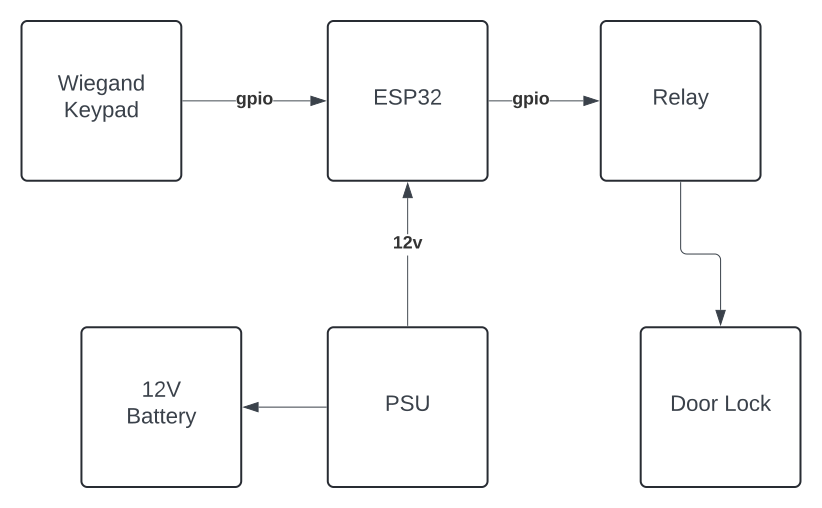
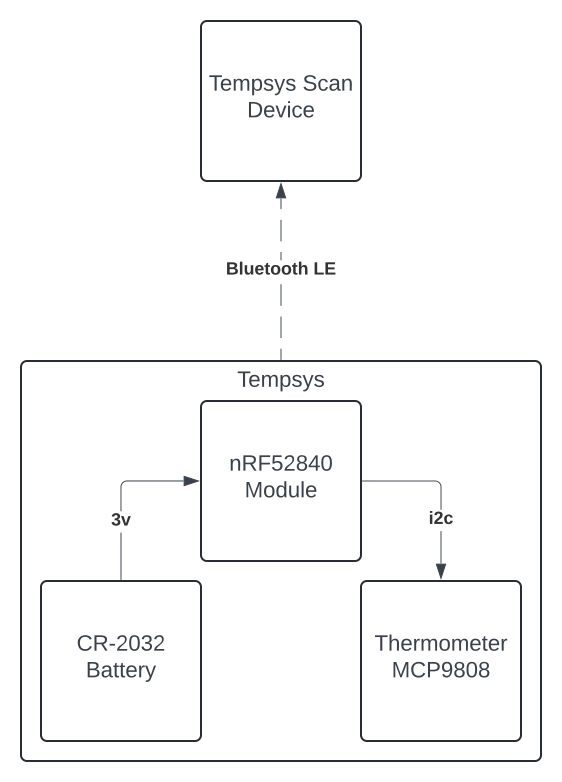

<!-- vim: set tw=80: -->

# Autosys

Various automation related IoT projects using rust that communicate primarily
using mqtt.

## Architecture

## Doorsys

Doorsys is a door access control system with centralized management and logs.

### Introduction

Doorsys was born from from the frustration with consumer grade smart locks. I
needed something more reliable with centralized logs, multiple access codes and
badges, and more importantly, remote management. After surveying the landscape,
I came to the conclusion that either I settle for a subpar solution using an
existing smart lock + app available on the marketplace, or I have to spend an
arm and a leg and step up to a solution that is more professional. I did
neither. I did what every engineer would. I'll roll my own! How difficult can it
be... Famous last words :)

Joke aside, I took it as a challenge. After some research, I figured the
hardware necessary was readily available online and an esp32 microcontroller
would be more than enough to run the firmware. I started the development of the
firmware using C and the official
[esp-idf](https://github.com/espressif/esp-idf) but later on switched to the
experimental but now highly capable rust [esp-rs](https://github.com/esp-rs)
implementation.

### Hardware Description

No rocket science here. The esp32 is connected to a relay using gpio in order to
operate the 12v based magnetic lock. A
[wiegand](https://en.wikipedia.org/wiki/Wiegand_interface) keypad is also
connected to the esp32 using 2 gpio ports. A 12v PSU with an external 12V
battery was added for continuous operation in face of a power outage. More
information, schematics, and PCB design can be found on the
[doorsys-hardware](https://github.com/fabiojmendes/doorsys-hardware) repository.

Block diagram:

### Software Overview

The software stack is decomposed in a few components. The
[doorsys-firmware](https://github.com/fabiojmendes/doorsys-firmware) repository
contains the firmware code which is responsible for:

- Interface with the wiegand keypad for user input.
- Activate the relay to open the door circuit.
- Send mqtt audit messages for any door user interaction. Successful or not.
- Receive mqtt messages for new or removed user codes and store them locally in flash.
- Send metrics of the current operation (heap and flash size) for observability purposes.

The [doorsys-protocol](https://github.com/fabiojmendes/doorsys-protocol)
repository contains the protocol messages exchanged between the firmware and the
api. I went for a very simple approach here using
[postcard](https://github.com/jamesmunns/postcard) to serialize the messages.
But not much was done in terms of backwards compatibility and schema evolution.
For now things are very simple and stable, but when the time comes perhaps
protobuf could be an option.

The [doorsys-api](https://github.com/fabiojmendes/doorsys-api) repository
contains the code for a [axum](https://github.com/tokio-rs/axum) based rest api
for the admin interface. The communication with the doorsys devices is carried
through mqtt for more reliability. The At-Least-Once (QoS 1) semantics of the protocol
is used to ensure messages are delivered even if components are offline. To deal
with message duplication, the consumers of the messages are idempotent.
For persistence, [sqlx](https://github.com/launchbadge/sqlx) and postgres are used.

The [doorsys-web](https://github.com/fabiojmendes/doorsys-web) repository
contains the admin interface for interacting with the API. It is a simple UI
using vuejs with bootstrap css. Just a console where you can add and
remove users, generate new pins, deactivate accounts or check the audit logs.

For observability, the firmware will constantly report heap and flash usage
using mqtt messages using the [InfluxDB line protocol](https://docs.influxdata.com/influxdb/v1/write_protocols/line_protocol_tutorial/)
format. Telegraf is used to consume those messages and write to the InfluxDB
instance while a grafana dashboard was setup for visualization.

### Deployment

The firmware has to be flashed straight to the device. The repo has more
instructions on how to do this.
Container images are provided for the api and web components which
can then be deployed using docker or podman.

## Tempsys

Tempsys is a monitoring system designed to measure the temperature
of commercial fridges and freezers. It is meant to monitor the behaviour of
these units and anticipate any possible failures or misuse and prevent food
degradation.

It consists of a extremely power efficient Bluetooth LE module coupled with a
MCP9808 i2c digital thermometer. The whole system is powered by a single CR-2032
coin cell battery with autonomy of more than a year.

While the low power bluetooth module is responsible to emit advertising
packets with the temperatures. A more powerful device connected to the main
power will collect those results and ship them via mqtt using the line
protocol as described earlier for doorsys.

On the backend, telegraf and influxdb are used to collect and store those metrics.
A Grafana [dashboard](#tempsys-dashboard) is configured with alerts in case
temperatures are sustained above certain threshold.

On top of the temperature, the module will also send its current voltage and
RSSI for observability purposes. This will help predict when it is time to
change the battery or if the device needs to be moved for better reception.

### Repositories

- [tempsys-hardware](https://github.com/fabiojmendes/tempsys-hardware) in-depth
  hardware description for the tempsys device
- [tempsys-firmware](https://github.com/fabiojmendes/tempsys-firmware)
  embassy-rs based firmware for tempsys
- [tempsys-scan](https://github.com/fabiojmendes/tempsys-scan) bluez based
  application to read the bluetooth advertizsing events from tempsys and ship them
  via mqtt

### Block Diagram

### Tempsys Dashboard

