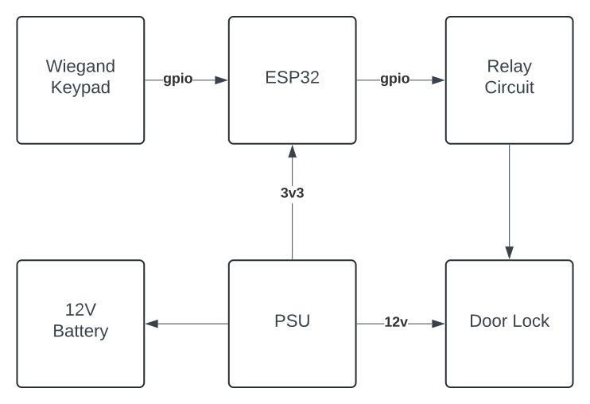

<!-- vim: set tw=80: -->

# Autosys

Various automation related projects using rust.

## Architecture

## Doorsys

Doorsys is a door access control system with centralized management and logs.

### Introduction

Doorsys was born from from the frustration with consumer grade smart locks.  I
needed something more reliable with centralized logs, multiple access codes and
badges, and more importantly, remote management. After surveying the landscape,
I came to the conclusion that either I settle for a subpar solution using an
existing smart lock + app available on the marketplace, or I have to spend an
arm and a leg and step up to a solution that is more professional. I did
neither. I did what every engineer would. I'll roll my own! How difficult can it
be... Famous last words :)

Joke aside, I took it as a challenge. After some research, I figured the
hardware necessary was readily available online and an esp32 microcontroller
would be more than enough to run the firmware. I started the development of the
firmware using C and the official
[esp-idf](https://github.com/espressif/esp-idf) but later on switched to the
experimental but now highly capable rust [esp-rs](https://github.com/esp-rs).

### Hardware Description

No rocket science here. The esp32 is connected to a relay using gpio in order to
operate the 12v based magnetic lock. A
[wiegand](https://en.wikipedia.org/wiki/Wiegand_interface) keypad is also
connected to the esp32 using 2 gpio ports. A 12v PSU with an external 12V
battery was added for continuous operation in face of a power outage.
More information, schematics, and PCB design can be found on the
[doorsys-hardware](/fabiojmendes/doorsys-hardware) repository.

Block diagram:

## Tempsys

[Tempsys](/TEMPSYS.md) is a temperature monitoring system designed to work with
commercial fridges and freezers
